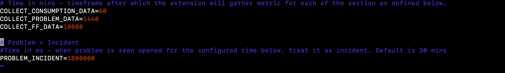
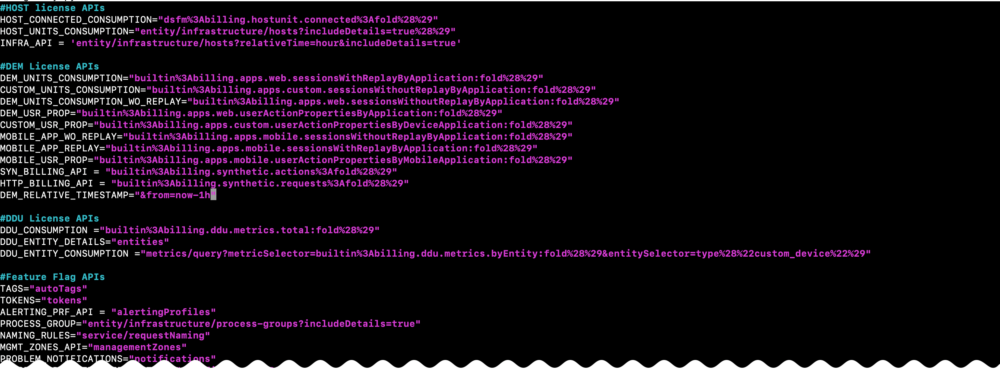
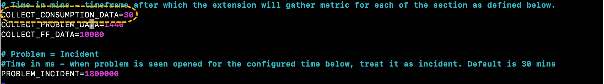
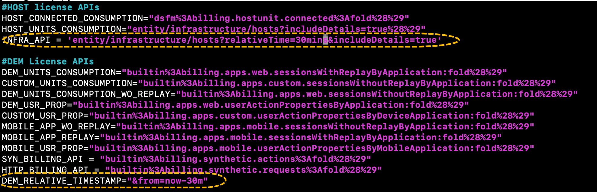

# Advanced Settings  

## Modifying the granularity for pulling the metrics  
The granularity of the different sections within the dashboard is governed by constant variables defined in `iteration.py`.  
  

The queries are defined in a file named `constant.py`. The relative time within the queries are adjusted to pull data as per the default configuration (every hour for consumption data, 1-day for problem data, a week for feature flags).  
  

To change the polling interval, modify `iteration.py` as per your requirement. Alongwith, also make sure the query has been modified in `constant.py`.  
For example, if one would like to pull consumption data for 30 mins (instead of 1-hour), they will have to make the following modifications:
1. Modify **COLLECT_CONSUMPTION_DATA=60** to **COLLECT_CONSUMPTION_DATA=30**  
2. Modify **INFRA_API and DEM_RELATIVE_TIMESTAMP** queries too in constant.py.

The modified constant.py and iteration.py would look the following for this case:  
  
  

Lastly, the problem data per management zone will report all the problems that has not been resolved within 30 mins. This is controlled by **PROBLEM_INCIDENT** flag in `iteration.py` and can be modified as per your requirement. Once modified, increment the plugin version in `plugin.json` by 1 and upload the extension.  

