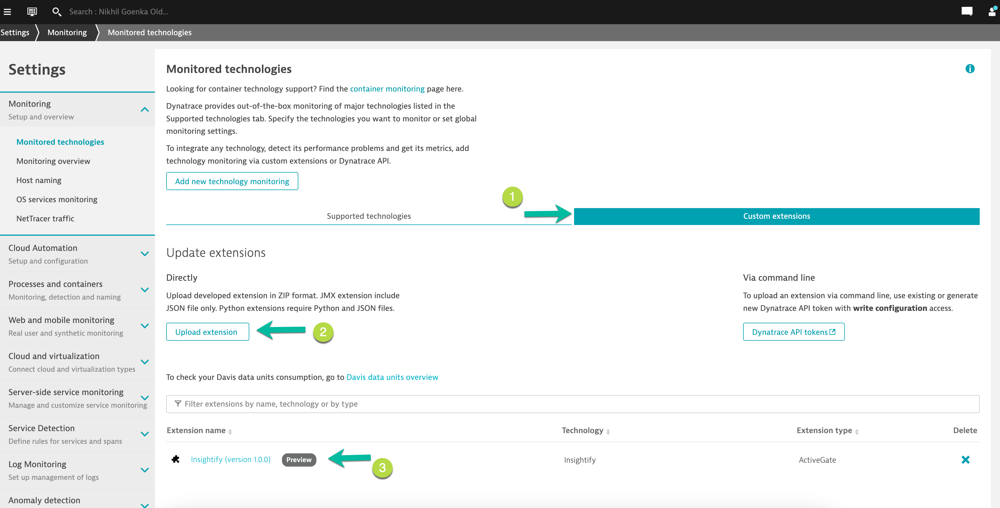
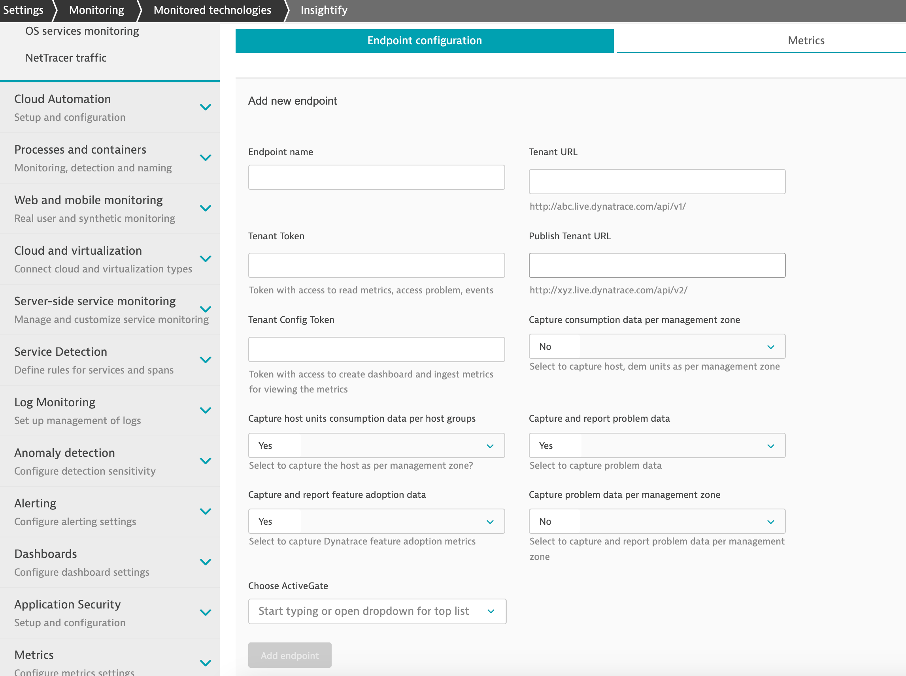
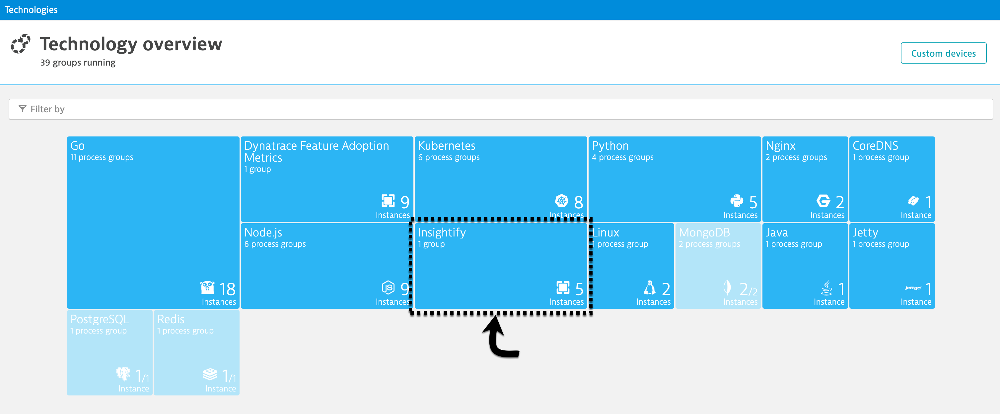
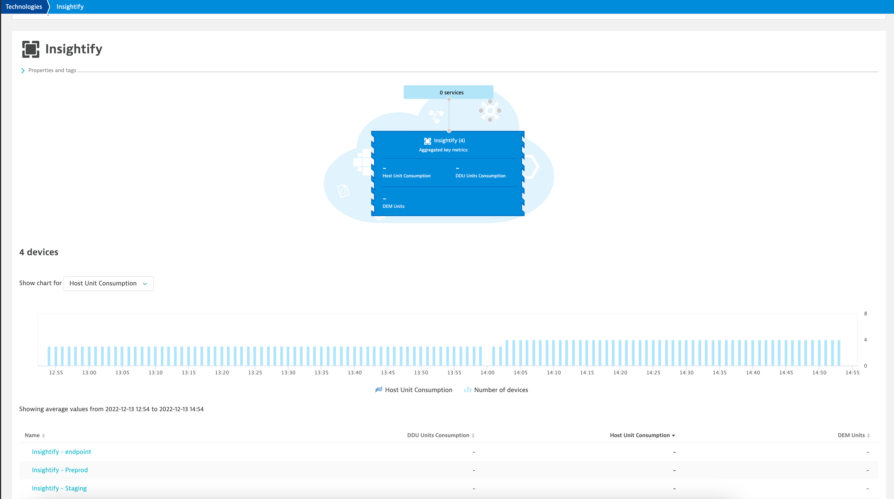
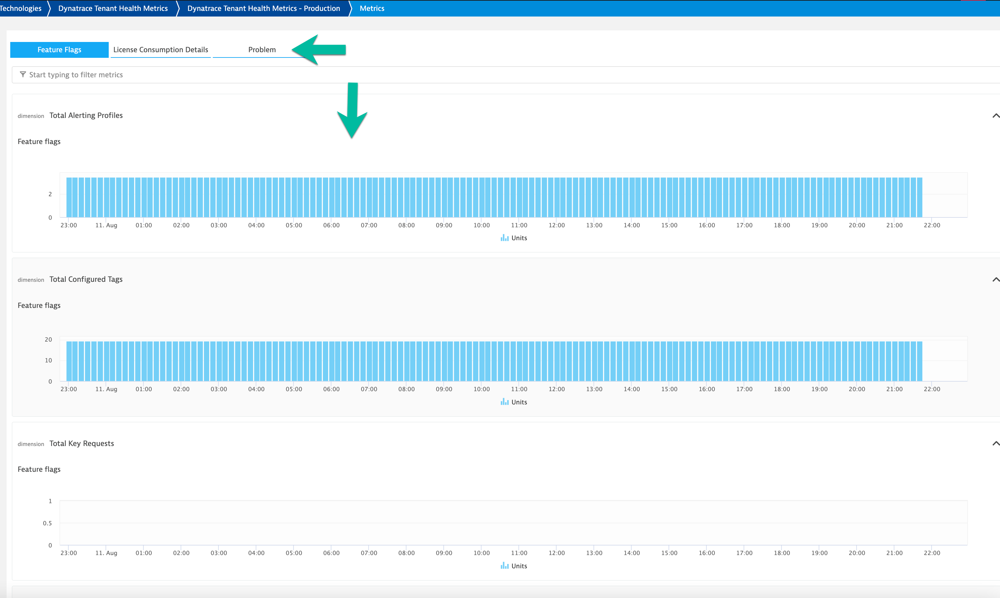

# Guides

### Deploy Extension

1. Within Dynatrace, navigate to **Settings >> Monitored technologies >> Custom extensions** tab  
   

2. Open `Insightify` and configure it.  
   

#### Configurables

**Endpoint name** The name that you want to refer the tenant with.  
**Tenant URL** The tenant-URL you would like to fetch data from.  
**Tenant Token** Token generated with access to read metrics, access problems, events. For details on how to generate token, refer to [help link](https://www.dynatrace.com/support/help/shortlink/token)  
**Tenant Config Token** Token generated with permissions to ingest metrics, read metrics, ingest logs (optional), write and read configuration.  
**Capture consumption data per management zone** Flag to capture consumption data (Host Units, DEM) and slice it per management zone. Default value of the configuration is **No**.  
**Capture host unit consumption data per host zone** Flag to capture Host Units and slice it as per host group. Default value of the configuration is **No**.  
**Capture and report problem data** Flag to pull problem data and report data on problems in the Insightify Dashboard/Device. Default value of the configuration is **Yes**.  
**Capture and report feature adoption data** Flag to pull problem data and report data on Dynatrace adoption flags in a dashboard named `Insightify Adoption Overview`. Default value of the configuration is **Yes**.  
**Capture and report problem data per management** Flag to pull problem data and report data on problems per management zone in a dashboard named `Insightify Incident Report`. Default value of the configuration is **No**.  
**Push problem details as log** Configure to push the problem details as logs. If configured, the endpoint will be used to push the problem details as logs using `/ingest/logs` api. By default, feature is disabled.  
**Value Benefit Realisation** Dashboard highlighting the cost savings using a default cost model. The dashboard is created once **Capture and report problem data per management** is enabled.  

3. Once configured, successful extension start. It should display the Ok status.

> The extension will take upto couple of minutes to initialize for the first run.

### Look around

1. Navigate to Technologies and find metrics for your endpoint:  
   

2. The Group page lets you analyze the group and view the performance of its members.  
   

3. Analyze various chart types on device page by navigating to the group instance (endpoint)  
   

4. Lastly, multiple dashboards will be created (depending on your configuration) for each of the endpoint for a quick view of each endpoint.  
     

   If you have enabled **Capture and report problem data per management zone**, an additional dashboard **Insightify: Incident Report: \<Endpoint-name\>** will be created.  
     

> Note: Consumption data per management-zone/host-group is available only on the dashboard view or under Data explorer.

