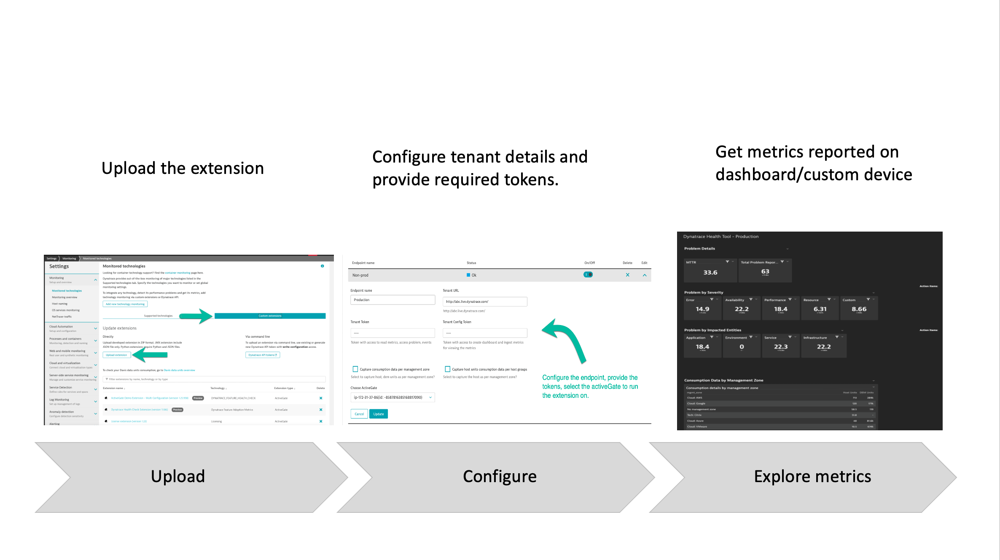

# Get Started

### What is Insightify Extension?  

Insightify Extension is an activeGate extension that is developed to pull and report key metrics. It leverages Dynatrace APIs to pull the metrics from the configured tenant. It will enable your customer to get a single pane of all the different health metrics in the tenant itself highlighting some of the usage and adoption features in Dynatrace.  

### How does it work?  

End-user uploads the extension on an activeGate and configure the endpoint. Once configured, they will start receiving the data and the data would be available a dashboard for that endpoint.  
  

### Features?  

The extension reports the following set of metrics:  
· **License Consumption Insight:** highlighting the current usage of DEM, DDUs, Host Units, Host Units.  
⚡Important: Please note that the license consumption figures provided should be used solely as a reference. These values are obtained through API calls, and in the event of any planned outages on activeGate, there may be a discrepancy between the reported figures by the extension and the actual consumption. Use caution and consider potential variations when relying on license statistics.  
· **Environment Feature flags:** The extension would report on the different feature flags that are currently being used in the environment (like Request attributes, Alerting
profiles. etc.)  
· **Problem Details:** this section would report on the MTTR, and the total number of problems received in the environment in the past month.  
· **Problem by Severity and Impacted Entities**: Dynatrace received problems classified by different severity along with the different entities (like Environment, Services, etc.)  
· **Problem by management zones:** This section, if enabled, will report problem data like MTTR, RCA availability, etc. sliced per management zone.  
· **Benefit Value Realisation:** This section will generate a report on the time spent on problems generated by Dynatrace, the cost spent towards it and the potential savings (once enabled).  

## Extension installation and configuration  
1. Find the extension from [here](https://github.com/Dynatrace/insightify/blob/main/insightify_1.0.7/custom.remote.python.insightify.zip)  
2. Download to get the extension ZIP file. **Don't rename the file.**  
3. Now,scp/ssh the zip file to the activeGate and unzip the extension ZIP file to the `plugin_deployment` (found at `/opt/dynatrace/remotepluginmodule/plugin_deployment/`) directory of your ActiveGate host.  
4. With the configuration on AG completed move to the Dynatrace menu and navigate to **Settings > Monitored technologies > Custom extensions and select Upload Extension.**  
5. Upload the ZIP file on Dynatrace.  
6. Enter the following endpoint information for pulling data:  
   Endpoint name - Any label to identify this connection. It is used for identification purposes.
   Tenant URL -    Tenant endpoint that you'd like to pull data from. Configure it as `https://abc.live.dynatrace.com/api/v1/`  
                   Replace abc with the tenant UUID for SaaS while for managed, configure the endpoint as `https://managed-server/e/environment-endpoint/api/v1/`  
   Tenant Token: Token that will be used to pull the data from the configured tenant. Make sure your token has the following permissions  
   1. Read problems (API v2)  
   2. User session query language (API v1)  
   3. CaptureRequestData (API v1)  
   4. Read metrics (API v2)  
   Publish URL -     Tenant where you would like to push the pulled metrics. Configure it as `http://xyz.live.dynatrace.com/api/v2/`  
                     Replace abc with the tenant UUID for SaaS while for managed, configure the endpoint as `https://managed-server/e/environment-endpoint/api/v2/`  
   Publish Token -   Token that will be used to push the metrics. Make sure your token has the following permissions  
                     1. Write config (Configuration API v1): To create a dashboard with the captured metrics.  
                     2. Read config (Configuration API v1) : Permission to access to verify if the dashboard is already created.  
                     3. Ingest Metrics (API v2): Permissions to push the host units, DEM units into Dynatrace.  
                     4. Read Metrics (API v2): Permissions to read the metrics.  
                     5. Ingest Logs (API v2): An Optional field to allow pushing the problem data retrieved as logs.  
Capture and report problem data -                   Set the configuration to **Yes** to pull problem data like MTTR, problem details, etc.  
Capture and report adoption data -                    Set the configuration to **Yes** to pull adoption data.  

`

