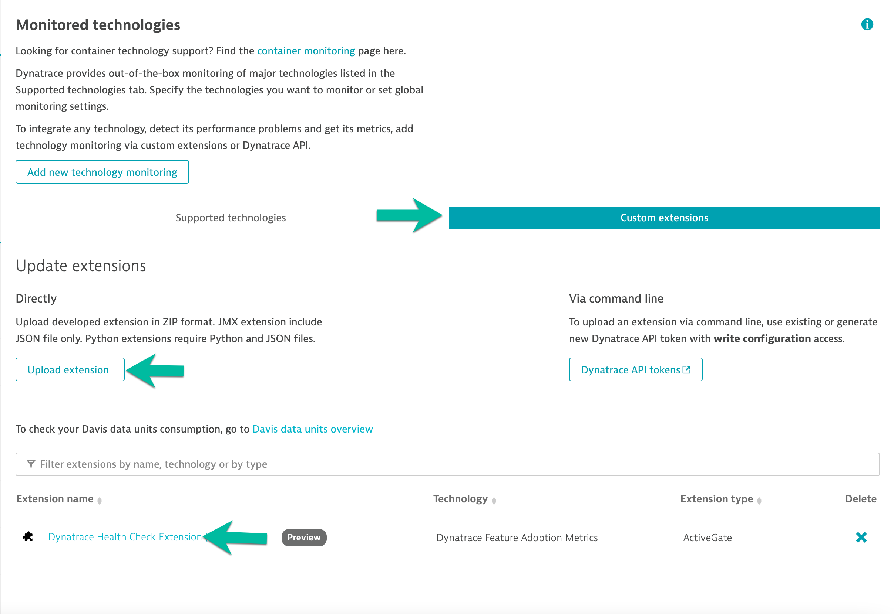
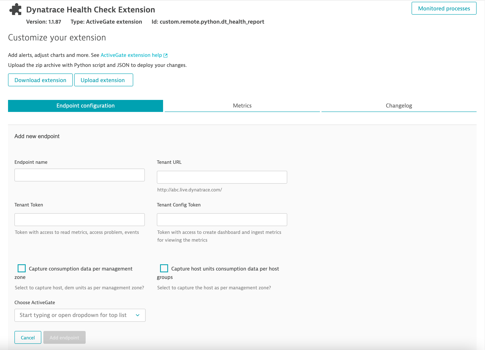
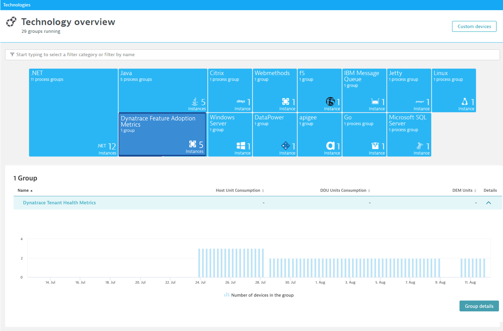
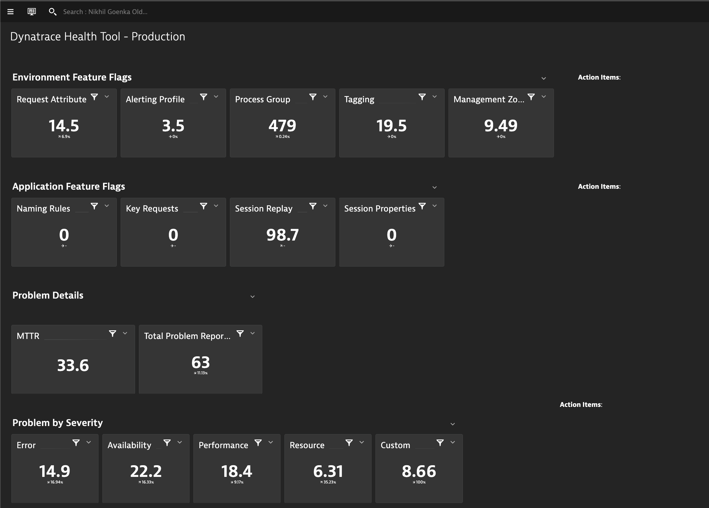
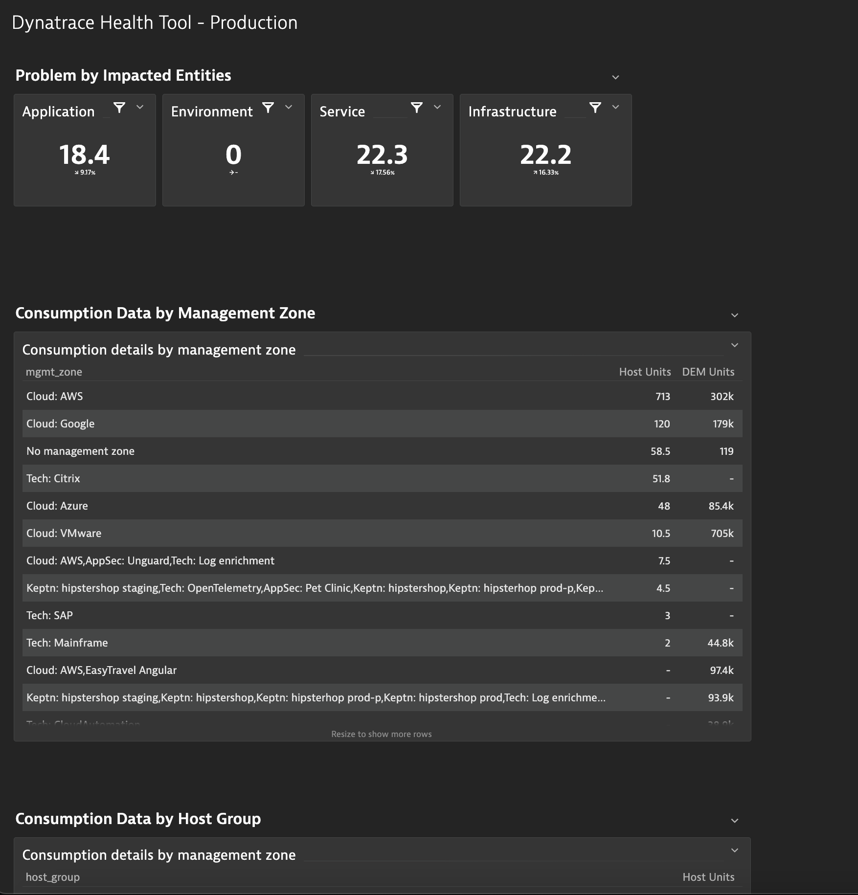
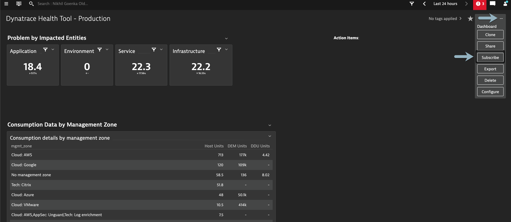
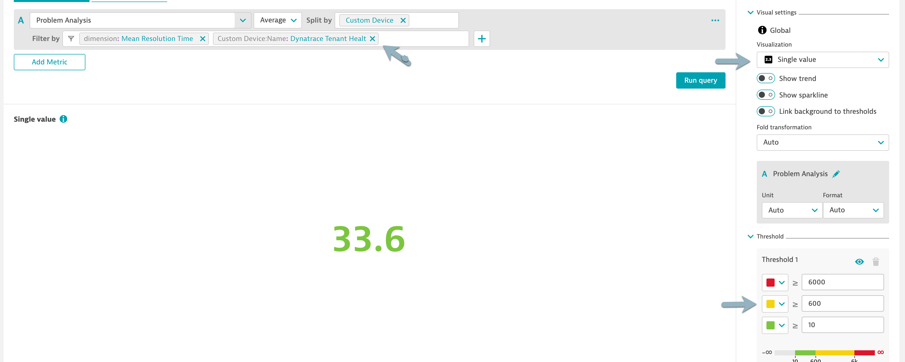

# Guides

### Deploy Extension

1. Within Dynatrace, navigate to **Settings >> Monitored technologies >> Custom extensions** tab  
   

2. Open `Dynatrace Health Check Extension` and configure it.  
   

#### Configurables

**Endpoint name** The name that you want to refer the tenant with.  
**Tenant URL** The tenant-URL you would like to fetch data from.  
**Tenant Token** Token generated with access to read metrics, access problems, events. For details on how to generate token, refer to [help link](https://www.dynatrace.com/support/help/shortlink/token)  
**Tenant Config Token** Token generated with permissions to ingest metrics, create dashboard.  
**Capture consumption data per management zone** Flag to capture consumption data (Host Units, DEM, DDU) and slice it per management zone.  
**Capture host unit consumption data per host zone** Flag to capture Host Units and slice it as per host group.

3. Once configured, successful extension start. It should display the Ok status.

> The extension might take upto 2 minutes to initialize for the first run.

### Look around

1. Navigate to Technologies and find `Dynatrace Feature Adoption Metrics`  
   

2. The Group page lets you analyze the group and view the performance of its members.  
   

3. Analyze various chart types on device page by navigating to the group instance (endpoint)  
   

4. Lastly, a dashboard will be created for each of the endpoint for a quick view of each endpoint.  
     
   

> Note: Consumption data per management-zone/host-group is available only on the dashboard view or under Data explorer.

### Additional use-cases

Whilst the extension generates the metrics and plot these onto the dashboard, there are some other features that you can leverage by doing additional configuration

#### Dashboard Reports

End-user can subscribe to get the dashboard reports weekly or monthly. More details on how to can be found in our help [documentation link](https://www.dynatrace.com/support/help/shortlink/dashboard-reports)  

#### Single value trend

Navigate to the `Data Explorer` screen for a specific metric and set expected thresholds for a specific metric. This can be powerful to get a quick view of say **MTTR**, etc.  

#### Setting custom alerts

You can setup custom alerts on any of the generated metrics so as to be alerted for any abberations. This could be particularly useful for use-cases wherein you as an end-user would like a specific group to be notified once their consumption goes beyond a threshold. To setup a custom alert, navigate to **Settings > Anomaly Detection >> Custom events for alerting** and set the threshold.  

In the above screenshot, a custom alert is setup for management zone `Cloud:AWS` to be alerted whenever the host consumption in endpoint `Non-prod` breaches 200.
